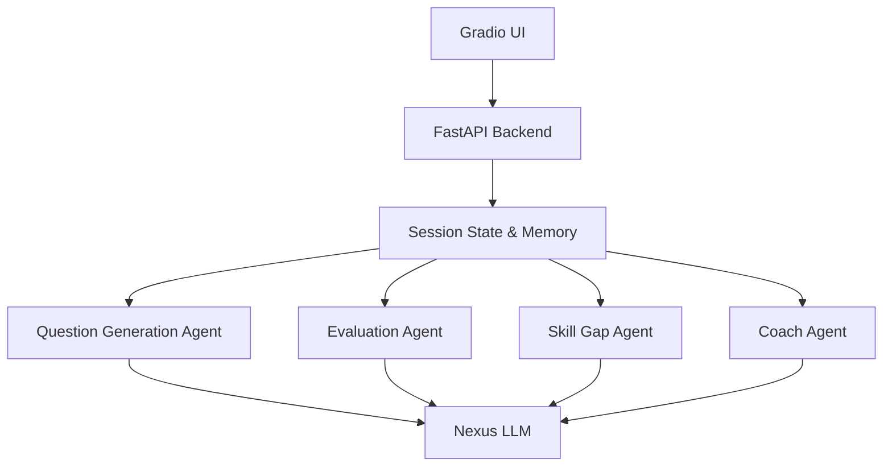

# 🚀 InterviewIQ: AI-Powered Interview Preparation & Mock Interview Assistant

## 👥 Team Members
- **Hassan Akbar Ansari**
- **Santoshi**
- **Arun Mohan K**

InterviewIQ is an advanced AI assistant that conducts role-specific mock interviews, evaluates candidate answers in real-time, identifies skill gaps, and generates personalized study plans. 

This project demonstrates the practical application of **Large Language Models (LLMs)**, **Multi-Agent Systems**, and advanced **Prompt Engineering**.

## 🧠 Core AI Concepts Demonstrated

1. **Prompt Engineering:**
   - **Role Prompting**: System prompts explicitly define strict interviewer personas.
   - **Few-Shot & Criteria Prompting**: Evaluator agents use strict criteria schemas to grade answers objectively.
   - **Chain-of-Thought**: Skill gap analysis agents reason through the transcript step-by-step before concluding.
   
2. **Multi-Agent Architecture:**
   - **Question Agent**: Dynamically generates targeted questions based on the candidate's resume and past answers.
   - **Evaluator Agent**: Scores answers on technical accuracy, clarity, and communication.
   - **Skill Gap Agent**: Analyzes the entire session to find recurring weak points.
   - **Coach Agent**: Converts identified gaps into a concrete 7-day study plan.

3. **Tool Calling & Structured Output:**
   - Leverages LangChain's `with_structured_output` (Pydantic) to force the LLM into generating strict JSON structures for the UI (like radar charts and daily study schedules).

## 🏗️ Architecture



## 🛠️ Tech Stack
- **Backend**: FastAPI, Python 3.9
- **Frontend**: Gradio (Blocks API)
- **AI/LLM Framework**: LangChain, Pydantic
- **Model Provider**: Nexus API (`nova-micro`)

## 🚀 Setup & Installation

1. **Clone the repository / open the folder:**
   ```bash
   cd interviewiq
   ```

2. **Create a Virtual Environment:**
   ```bash
   python3 -m venv .venv
   source .venv/bin/activate
   ```

3. **Install Dependencies:**
   ```bash
   pip install -r requirements.txt
   ```

4. **Environment Variables:**
   Make sure you have a `.env` file in the root directory with your credentials:
   ```env
   NEXUS_API_KEY=your_nexus_api_key_here
   NEXUS_BASE_URL=https://nexusapi.navigatelabs.ai/v1
   NEXUS_MODEL=nova-micro
   USE_CUSTOM_NEXUS_WRAPPER=false
   ```

5. **Run the Application:**
   ```bash
   python app.py
   # or
   uvicorn app:app --reload
   ```
   *The UI will be available at `http://localhost:8000/gradio`*

## 🎯 Demo Scenarios (For Faculty Presentation / Viva)

1. **Behavioral STAR Check**: Select "Fresher" and "Behavioral". Watch the evaluator actively check if your answers follow the STAR format (Situation, Task, Action, Result).
2. **Adaptive Probing**: Select "Technical" and provide a deliberately vague answer. The Question Agent will dynamically generate a targeted follow-up question to probe for more detail.
3. **Resume Injection**: Upload a PDF resume. The system will parse it and the Question Agent will ask highly specific questions about the projects listed on it.
4. **Structured Radar Chart**: End an interview to demonstrate how the LLM's strict JSON output natively builds a beautiful Radar Chart mapping out your skill categories in the Results tab.
5. **Multi-Agent Transparency**: Click on the "Agent Trace" tab to show your faculty exactly how the different agents are talking to each other and executing LangChain Tools in the background.

## 📸 Screenshots


*(Note: You can replace `screenshot.png` above with the actual file path if you save the screenshot differently.)*